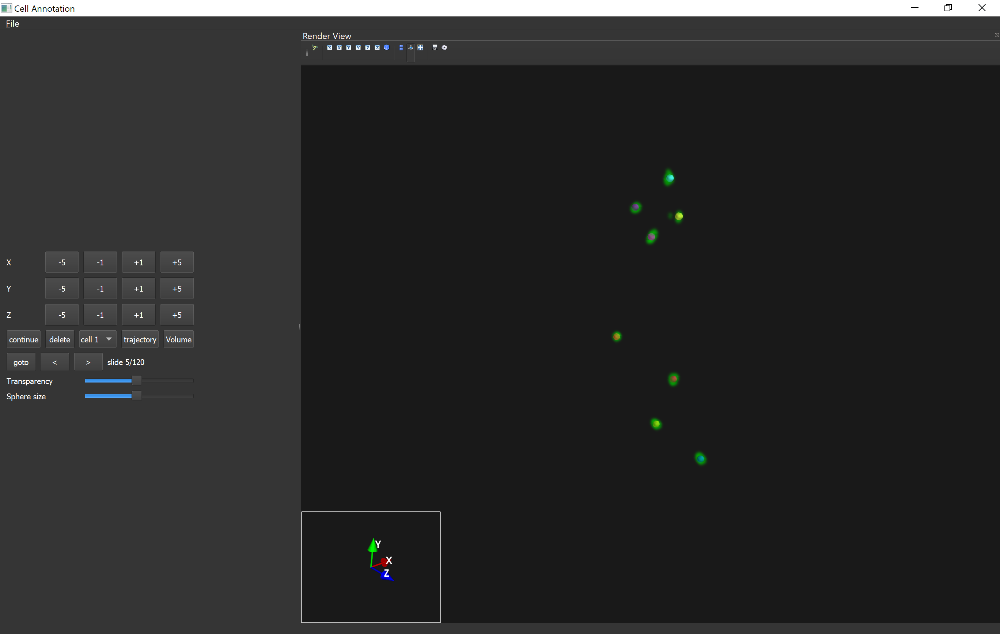

# 3D Annotation Tool for TIFF volumes

Interactive annotation tool for trajectories cells in 3D. This tool is built from a fork of annot3d. Annot3d was made by Zoraiz Qureshi. The tool allows for the projection of cells in 3D and allows the user to annotate the trajectory of those cells. Results can be exported as an excel file.


## Dependencies:
Install all required dependencies by:
```!bash
pip install -r requirements.txt
```

## Run:
```!bash
python main.py
```
# Instructions

Put the files you want to project in the data folder before start up. The expected file names are x++x.tiff, these files are sorted based on the x after the ++. After this main.py can be run.\
In the projection clicking the left mouse button will result in setting an annotation. Dragging the mouse will rotate the projection while holding the left mouse button. Dragging the mouse while holding the right mouse button allows the user to zoom in.
The Axis buttons allows the user to adjust the annotation. This is best done white the axis indicator. It can be displayed by the Toggle axis indicator button above the projection.\
The < and > button will change the projection to the previous or next slide.\
The Goto button changes the projection to a specific slide.\
The continue button will set an annotation of the same location is in the previous slide.\
The delete button will remove the current annotation. \
The cell selection dropdown menu changes the cell that is being annotated.\
The trajectory button will toggle the display of the annotated trajectory of the currently selected cell.\
The Volume button will toggle the display of the 3D cell projection
The transparency slider will set the transparency lower or higher.\
The Sphere size slider changes the size of the spheres used to display the annotation location.\

\
For more information about interacting with the Mayavi window, see: [https://mayavi.readthedocs.io/en/latest/application.html#interaction-with-the-scene](https://mayavi.readthedocs.io/en/latest/application.html#interaction-with-the-scene)